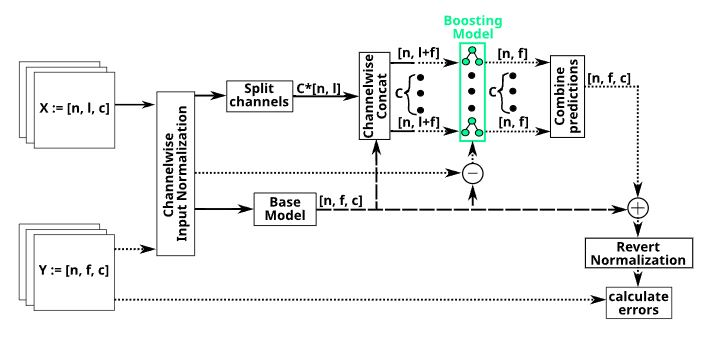
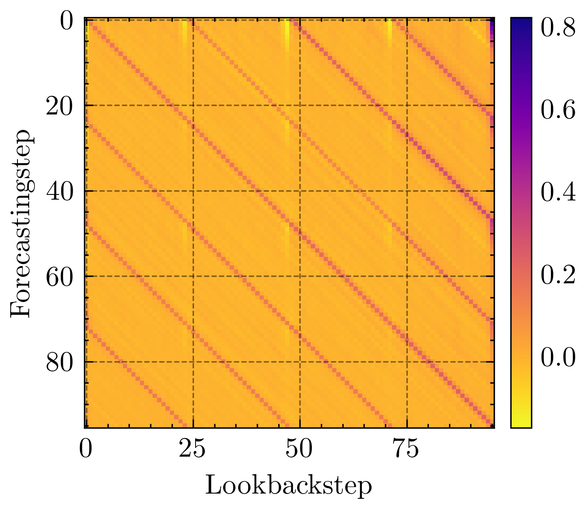
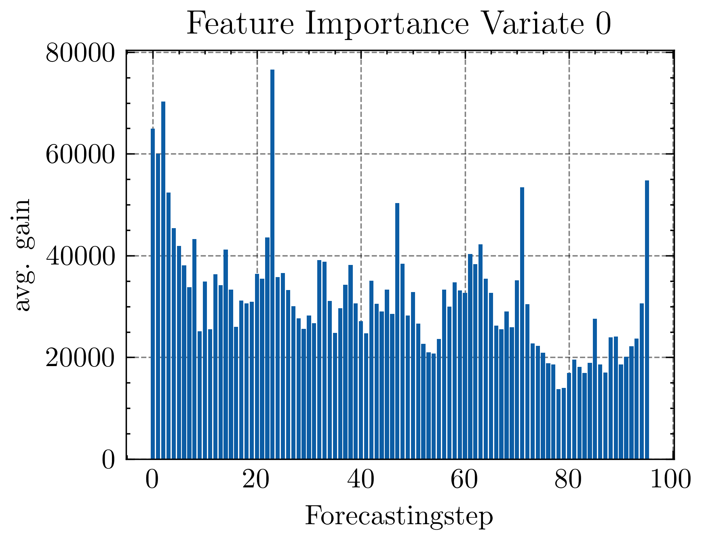
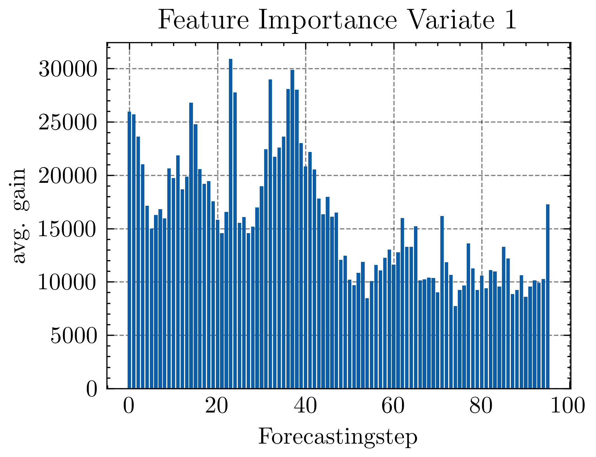

# LTBoost: Boosted Hybrids of Ensemble Linear and Gradient Algorithms for the Long-term Time Series Forecasting

This repository is the official Pytorch implementation of [LTBoost](https://dl.acm.org/doi/10.1145/3627673.3679527) (CIKM24). 
This code is based on the code bases of LTSF-Linear and Autoformer. 


## LTBoost Hybrid model

LTBoost employs an effective boosted hybrid strategy that combines a simple one-layer linear model with multiple non-linear, tree-based gradient boosting ensembles. 

First, the one-layer linear model forecasts multivariate time series by leveraging both intra-channel and inter-channel information. Afterwards, multiple LightGBM univariate-forecasting models are conditioned on the residual errors of the linear model. This approach combines the strengths of the linear model and the gradient boosting trees. In this way the multivariate input capability of LTBoost allows for capturing both long-term inter-channel dependencies and intra-channel interactions.


Below, one can see a depiction of LTBoost's training regime.
Normal lines indicate past values, and dashed lines indicate future values. Please note that:
𝑛 = #𝑠𝑎𝑚𝑝𝑙𝑒𝑠, 𝑙 = 𝑙𝑜𝑜𝑘𝑏𝑎𝑐𝑘 − 𝑤𝑖𝑛𝑑𝑜𝑤, 𝑓 = 𝑓𝑜𝑟𝑒𝑐𝑎𝑠𝑡𝑖𝑛𝑔 ℎ𝑜𝑟𝑖𝑧𝑜𝑛, 𝑐 = #𝑐ℎ𝑎𝑛𝑛𝑒𝑙𝑠/𝑣𝑎𝑟𝑖𝑎𝑡𝑒𝑠.



### LTSF-Linear

LTSF-Linear is a set of linear models that outperform Transformers.

- **Linear**: A one-layer linear model.
- **NLinear**: A one-layer linear model with input normalization to handle distribution shifts in the dataset. 
- **DLinear**: Two one-layer linear models. One layer predicts the trend component (derived by a moving average kernel) and the other layer predicts the remainder (seasonal) component.  

LTSF-Linear models are highly efficient in terms of memory and speed, offer interpretability, and deliver competitive forecasting accuracy. Although these models benefit from GPU utilization, a GPU is not required for their operation.

We are grateful for the LTSF-Linear GitHub repository and its valuable code base, which is licensed under the Apache License, Version 2.0. You can access the original work at [LTSF-Linear GitHub](https://github.com/cure-lab/LTSF-Linear).

Further reading: [Are Transformers Effective for Time Series Forecasting?](https://ojs.aaai.org/index.php/AAAI/article/view/26317)


### LightGBM

[LightGBM](https://lightgbm.readthedocs.io/en/latest/index.html) is a robust gradient boosting framework that provides decision tree-based machine learning algorithms suitable for a wide range of tasks. Notably efficient on CPUs, LightGBM stands as a compelling alternative to other boosting frameworks such as XGBoost. It distinguishes itself by employing a leaf-wise tree growing strategy, gradient-based one-side sampling, and exclusive feature bundling. Frequently a top contender in data science competitions on [Kaggle](https://www.kaggle.com/code/prashant111/lightgbm-classifier-in-python), LightGBM is especially prevalent in time series forecasting competitions, consistently ranking among the best models.


We deeply appreciate the contributions of the LightGBM project which is licensed under the MIT license, whose code we have incorporated into our files. The original work can be found at [LightGBM GitHub](https://github.com/microsoft/LightGBM/).


Further reading: [LightGBM: A Highly Efficient Gradient Boosting Decision Tree](https://proceedings.neurips.cc/paper_files/paper/2017/file/6449f44a102fde848669bdd9eb6b76fa-Paper.pdf)


## Comparison of Multivariate Forecasting Performance

We evaluated the performance of LTBoost on nine established benchmark datasets against 13 recent models and a vector autoregression (VAR) baseline. Each model was tested on four forecasting horizons. LTBoost demonstrated superior performance, achieving state-of-the-art results in 32 out of 36 cases, representing more than 88% of the cases when evaluated by mean absolute error (MAE). Regarding mean squared error (MSE), LTBoost outperformed other models in 23 of 36 cases, accounting for more than 63%.

The **detailed performance comparison** is presented in **Table 3**, where the best results are highlighted in bold, the secondbest results are marked with double underline, and the third-best results with one underline. Lower MAE and MSE values indicate better performance, clearly showcasing LTBoost’s leading accuracy across a broad range of conditions and metrics.

### Drop_last=False
In accordance with the best practices outlined by  ([Qiu *et al.*](https://arxiv.org/pdf/2403.20150)), we used `drop_last=False`. This adjustment ensures that the last incomplete batches are not discarded during evaluation. This clarification corrects our statement in the original paper where we **mistakenly** noted that we dropped the last batch.


## Getting Started
### Environment Requirements

First, please make sure you have installed Conda. Then, our environment can be installed by:
```
conda create -n LTBoost python=3.9
conda activate LTBoost
pip install -r requirements.txt
```

### Data Preparation

You can obtain all the nine benchmarks from [Google Drive](https://drive.google.com/drive/folders/1ZOYpTUa82_jCcxIdTmyr0LXQfvaM9vIy) provided by Autoformer. The datasets are already pre-processed and easy-to-use.

Create a **dataset** directory:
```
mkdir dataset
```
**Please put them in the `./dataset` directory**


### How to run LTBoost
We provide forecasting script files in `./scripts/EXP-LongForecasting`:
| Directory | Interpretation                                               |
| --------- | ------------------------------------------------------------ |
| Linear    | Long-term Time Series Forecasting (LTSF) using Linear models |
| LTBoost   | LTSF using LTBoost                                           |


To train the **LTBoost** model on the **ILI dataset**, you can use the script `scripts/EXP-LongForecasting/LTBoost/ili.sh`:
```
sh scripts/EXP-LongForecasting/LTBoost/ili.sh
```

Similarly for **LTSF-Linear**, you can use:
```
sh scripts/EXP-LongForecasting/Linear/ili.sh
```
Please note that the name of the linear model (Linear, DLinear, NLinear) can be specified in the script and is NLinear by default.

After running any script, the results can be found in `logs/LongForecasting`.


### Ablation Study
To rerun the ablation study described in the paper, you can use the script `scripts/Ablation/ablation.sh`: 
```
sh scripts/Ablation/ablation.sh
```
After running the script, the results can be found in `logs/Ablation`.
The ablation study takes some time to run since several models will be trained.


## LTBoost Colab Demo
We additionally provide the following easy-to-use colab notebooks to showcase **LTBoost**.


| Dataset | Forecasting Horizon | Notebook link                                                                                                                                                                     |
| ------- | ------------------- | --------------------------------------------------------------------------------------------------------------------------------------------------------------------------------- |
| ILI     | 60                  | [](https://colab.research.google.com/github/hubtru/LTBoost/blob/main/jupyter_notebooks/demo_ILI_60.ipynb)   |
| Etth1   | 96                  | [](https://colab.research.google.com/github/hubtru/LTBoost/blob/main/jupyter_notebooks/demo_etth1_96.ipynb) |

## LTBoost Chugging Space

<p>
  LTBoost HuggingFace Link: 
  </a>
  <a href="https://huggingface.co/spaces/hubtru/LTBoost">
    
  </a>
</p>


## Interpretability

LTBoost is designed to provide excellent interpretability. Both components of LTBoost, the linear model and the LightGBM ensembles, are inherently interpretable. This design choice allows researchers to derive insights that can aid in model development and understanding.

### Weight Visualization
As described by the authors of [LTSF-Linear](https://github.com/cure-lab/LTSF-Linear), the weights of the linear models and the linear component of LTBoost can be easily visualized using our adapted version of `weight_plot.py`. Simply add the model path (or model name) to the script and run it to generate the visualizations, which will be saved in a `weights_plot` directory.


### Feature Importance
Tree-based methods like those utilized by LightGBM allow for straightforward quantification of feature importance through the average gain of features. This capability not only enhances the interpretability of the model but also provides valuable insights into the decision-making processes of our LightGBM ensembles.

### Example
To illustrate, we trained LTBoost on the ETTh1 dataset using a look-back window of 96 and a forecasting length of 96. Below, you can view the weights of LTBoost's linear component as well as the feature importance from two LightGBM models within LTBoost's tree component.

<div style="display: flex; justify-content: space-between;">
  
  
  
</div>

## Datasets

The LTBoost framework is evaluated using nine well-established open-source long-term time series forecasting benchmarks. These datasets are tailored to specific use cases, including traffic, weather, disease spread, and industrial problems, and characterized by their multivariate nature. 

### Dataset Descriptions


- **Electricity** [🔗](https://archive.ics.uci.edu/dataset/321/electricityloaddiagrams20112014) [^1]: Hourly electricity consumption data of 321 clients from 2012 to 2014 with a total of 26,304 time steps. The last client is labeled as the target value "OT".
- **Exchange Rate** [^2]: Daily exchange rates of eight countries' currencies against the US dollar from 1990 to 2010, totaling 7,588 timesteps.
- **Traffic** [🔗](https://pems.dot.ca.gov/): Hourly road occupancy rates of 862 sensors on San Francisco highways during 2015-2016, comprising 175,544 timesteps. The last sensor is labeled as the target "OT".
- **Weather** [🔗](https://www.bgc-jena.mpg.de/wetter/): Data recorded every 10 minutes in 2020, includes 52,696 time steps with 21 weather indicators. The target value is "$CO_2$", labeled as "OT".
- **ILI** [🔗](https://gis.cdc.gov/grasp/fluview/fluportaldashboard.html): Weekly ratios of patients with influenza-like illness from seven Centers for Disease Control and Prevention in the US, spanning from 2002 to 2021 with 966 time steps.
- **ETT** [🔗](https://github.com/zhouhaoyi/ETDataset) [^1]: Datasets ETTh1, ETTh2 (hourly) and ETTm1, ETTm2 (15-minute-level) detailing oil and load features of electricity transformers from July 2016 to July 2018.

[^1]: [Zhou et al., 2021 Informer](https://arxiv.org/abs/2012.07436)
[^2]: [Lai et al., 2018 Modeling](https://arxiv.org/abs/1703.07015)

### Dataset Characteristics Table

Refer to the following table for a summary of the datasets' characteristics, including their variates, timesteps and granularity. 

| Dataset       | #Variates | #Timesteps | Granularity |
| ------------- | --------- | ---------- | ----------- |
| Electricity   | 321       | 26,304     | hourly      |
| Exchange Rate | 8         | 7,588      | daily       |
| Traffic       | 862       | 175,544    | hourly      |
| Weather       | 21        | 52,696     | 10 min      |
| ILI           | 7         | 966        | weekly      |
| ETTh1         | 7         | 17,420     | hourly      |
| ETTh2         | 7         | 17,420     | hourly      |
| ETTm1         | 7         | 69,680     | 15 min      |
| ETTm2         | 7         | 69,680     | 15 min      |


## Detailed Dataset Descriptions

This appendix provides a more detailed description of the nine real-life datasets used in the evaluation of the LTBoost framework. These datasets, selected for their complexity and real-world applicability, span a wide range of domains including electricity consumption, currency exchange rates, traffic occupancy rates, weather conditions, influenza-like illness occurrences, and electricity transformer temperatures.

### Electricity
The [Electricity dataset](https://archive.ics.uci.edu/ml/datasets/electricityLoadDiagrams20112014), available from the well established UC Irvine Machine Learning Repository, encompasses hourly electricity consumption data (in kWh) for 321 clients from 2012 to 2014. A [cleaned version](https://github.com/laiguokun/multivariate-time-series-data/tree/master/electricity) of this dataset, includes a comprehensive record across 26,304 timesteps. The dataset identifies its final client as target value *OT*, providing a detailed overview of consumption patterns over the specified period.

### Exchange Rate
The [Exchange Rate dataset](https://arxiv.org/abs/1703.07015) captures the daily exchange rates of eight countries' currencies against the U.S. dollar, encompassing Australia, Great Britain, Canada, Switzerland, China, Japan, New Zealand, and Singapore. Spanning from January 1, 1990, to October 10, 2010, this dataset offers a detailed view through 7,588 timesteps. For a succinct summary of the currencies involved, refer to the table below.

| Variate | Country       | Currency                 |
| ------- | ------------- | ------------------------ |
| 0       | Australia     | Australian dollar (AUD)  |
| 1       | Great Britain | Sterling (GBP)           |
| 2       | Canada        | Canadian dollar (CAD)    |
| 3       | Switzerland   | Swiss franc (CHF)        |
| 4       | China         | Renminbi (CNY)           |
| 5       | Japan         | Japanese yen (JPY)       |
| 6       | New Zealand   | New Zealand dollar (NZD) |
| OT      | Singapore     | Singapore dollar (SGD)   |

### Traffic

The [Traffic dataset](https://pems.dot.ca.gov/), derived from the California Department of Transportation, features road occupancy rates measured on a scale from 0 to 1 across 17,544 hourly timesteps, spanning the years 2015 to 2016. Data were collected using 862 sensors deployed along the freeways of San Francisco, with the final sensor designated as target value *OT*.

### Weather

The [Weather dataset](https://www.bgc-jena.mpg.de/wetter/Weatherstation.pdf), recorded in 2020, captures data with a 10-minute granularity, incorporating 21 weather indicators across 52,696 timesteps. Within this dataset, the final indicator, specifically the *$CO_2$* concentration, is denoted as target value *OT*. For an introductory summary of these indicators, see the table below, and for further details.


| Symbol   | Unit           | Variable                                    |
| -------- | -------------- | ------------------------------------------- |
| p        | mbar           | air pressure                                |
| T        | °C             | air temperature                             |
| T_pot    | K              | potential temperature                       |
| T_dew    | °C             | dew point temperature                       |
| rh       | %              | relative humidity                           |
| VP_max   | mbar           | saturation water vapor pressure             |
| VP_act   | mbar           | actual water vapor pressure                 |
| VP_def   | mbar           | water vapor pressure deficit                |
| sh       | g kg^-1        | specific humidity                           |
| H2OC     | mmol mol^-1    | water vapor concentration                   |
| rho      | g m^-3         | air density                                 |
| wv       | m s^-1         | wind velocity                               |
| max. wv  | m s^-1         | maximum wind velocity                       |
| wd       | degrees        | wind direction                              |
| rain     | mm             | precipitation                               |
| raining  | s              | duration of precipitation                   |
| SWDR     | W m^-2         | short wave downward radiation               |
| PAR      | μmol m^-2 s^-1 | photosynthetically active radiation         |
| max. PAR | μmol m^-2 s^-1 | maximum photosynthetically active radiation |
| Tlog     | °C             | internal logger temperature                 |
| CO2      | ppm            | CO$_2$-concentration of ambient air         |

### Influenza-like Illness (ILI)

The [Influenza-like Illness (ILI)](https://gis.cdc.gov/grasp/fluview/fluportaldashboard.html) dataset encapsulates the weekly incidence rates of influenza-like illness reported by seven Centers for Disease Control and Prevention (CDC) across the United States. Spanning from 2002 to 2021, this dataset aggregates a total of 966 weekly observations, offering a comprehensive view of ILI trends over nearly two decades.

The dataset is particularly notable for its detailed breakdown of ILI cases, categorizing data according to patient age groups and the reporting healthcare providers, among other variates. Such granularity enables nuanced analyses of ILI spread patterns, potentially aiding in the development of targeted public health responses.

| Variable          | Description                                            |
| ----------------- | ------------------------------------------------------ |
| % WEIGHTED ILI    | Percentage of ILI patients weighted by population size |
| % UNWEIGHTED ILI  | Unweighted percentage of ILI patients                  |
| AGE 0-4           | Number of 0-4 year old ILI patients                    |
| AGE 5-24          | Number of 5-24 year old ILI patients                   |
| ILITOTAL          | Total number of ILI patients                           |
| NUM. OF PROVIDERS | Number of healthcare providers                         |
| OT                | Total number of patients                               |

### Electricity Transformer Temperature (ETT)
The [ETT datasets](https://github.com/zhouhaoyi/ETDataset) include ETTh1, ETTh2 (hourly granularity), and ETTm1, ETTm2 (15-minute granularity). These datasets encompass detailed recordings of seven distinct oil and load features for two electricity transformers, offering an in-depth look at their operational dynamics. Spanning from July 2016 to July 2018, the datasets collectively provide respectively 17,420 and 69,680 timesteps of data, showcasing a comprehensive temporal coverage.

| Variable | Description         |
| -------- | ------------------- |
| HUFL     | High Useful Load    |
| HULL     | High Useless Load   |
| MUFL     | Middle Useful Load  |
| MULL     | Middle Useless Load |
| LUFL     | Low Useful Load     |
| LULL     | Low Useless Load    |
| OT       | Oil Temperature     |


## Citing
If you find LTBoost useful for your work, please consider citing us as follows:

```BibTeX
@inproceedings{LTBoost2024,
author = {Truchan, Hubert and Kalfar, Christian and Ahmadi, Zahra},
title = {LTBoost: Boosted Hybrids of Ensemble Linear and Gradient Algorithms for the Long-term Time Series Forecasting},
year = {2024},
booktitle = {Proceedings of the 33rd ACM International Conference on Information and Knowledge Management},
pages = {2271–2281},
series = {CIKM '24}
}
```

Please also remember to cite all the datasets, [LightGBM](https://lightgbm.readthedocs.io/en/latest/index.html) and [LTSF-Linear](https://github.com/cure-lab/LTSF-Linear) if you use LTBoost in your experiments.
